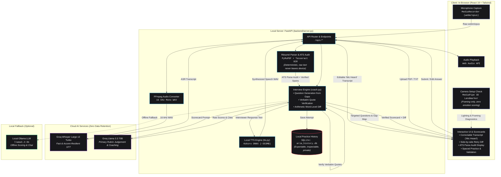

# Aria — the interview coach that shows its work

**Aria shows you what the machine actually received — not what you meant.**

A voice-first interview practice coach. You talk; Aria shows you the transcript it
heard, the résumé text an ATS would extract, the exact words behind every piece of
feedback, how much its own score wobbles, and what it refuses to score at all.

> **Aria never invents a number for you — not in your résumé, not in your interview.**
> Every strength cites a verbatim span. Every missing fact is a `[add metric]`
> placeholder, never a fabricated figure.

---

## The problem

Three defects are invisible to the candidate and measurable in the research:

1. **ASR mishears accents, and the score is computed from the corrupted text.**
   Regional-accent bias measurably reduces hireability ratings
   ([Maindidze et al. 2025](https://onlinelibrary.wiley.com/doi/10.1111/ijsa.12519)),
   and ASR atypical-speech bias is documented as a live harm
   ([Ada Lovelace Institute, 2026](https://www.adalovelaceinstitute.org/report/scribe-and-prejudice/)).
   A candidate who answers perfectly can be told to "add more metrics" for a sentence
   the *machine* got wrong. Aria scores instantly, then shows you the exact transcript it
   scored and lets you correct a misheard word and re-score.

2. **Nobody publishes how wrong their scores are.** LLM-as-judge shows low intra-rater
   reliability across identical runs, and forcing determinism makes agreement with humans
   *worse* ([Rating Roulette, arXiv 2510.27106](https://arxiv.org/html/2510.27106)).
   The whole category ships a 0–100 number and a disclaimer. Aria measures and publishes
   its own error bars (see below).

3. **Nobody shows the machinery.** Your résumé: *this is what the parser extracted.*
   Your answer: *this is what the mic heard.* Your score: *and here's exactly which of
   your words it came from.* The category optimises for you getting hired; a tool that
   shows the machinery and then declines to fabricate is a position competitors cannot
   copy without changing their business model.

---

## What it does

**Free chat** — push-to-talk (or type) conversational practice. `Space` or the mic
button interrupts Aria mid-sentence.

**Interview coach** — upload a résumé (PDF/TXT, OCR'd if scanned), pick one of five
documented interviewer personas, and get six questions written from *your* facts, scored
on a five-dimension HR scorecard:

| Dimension | Max | What it measures |
|---|---|---|
| `relevance_structure` | 25 | STAR shape, on-topic, no rambling |
| `specificity_evidence` | 25 | concrete detail, numbers, baselines, "I" not "we" |
| `impact_ownership` | 20 | measurable outcome, ownership, decision quality |
| `communication` | 15 | clarity, concision, spoken readability |
| `self_awareness` | 15 | reflection, what they'd change, coachability |

Then, the parts that are actually different:

### ATS parse audit — "here's what the ATS actually read"
A deterministic (no-LLM) audit of the PDF: column detection, table count, images,
repeating headers/footers, section detection, contact extraction, encoding artefacts.
It shows **the raw text the parser read** next to a flag explaining every divergence.
This is the brief's *"suggests improvements for ATS compatibility"* — without shipping a
second uncalibrated ATS score, because ATS vendor match-scores are opaque even by their
own admission.

### Correctable transcript — the one moment you watch Aria be wrong, then right
Aria scores and answers the moment you stop speaking, so the interview stays a conversation.
The transcript it actually scored sits on the scorecard as *mic heard* — fix one misheard
word, hit **Re-score**, and watch the score move (62 → 78, +16) with the before/after shown
to you. The correction updates the same attempt in place: one question, one record, one truth.

### Evidence-cited feedback
Every strength, improvement and red flag is an object with a **verbatim quote**, verified
against the actual transcript or résumé before display. A quote that cannot be found is
dropped and the observation is re-labelled *general suggestion*. Aria never presents a
fabricated quote as evidence.

### Job-description grounding
Paste a JD and Aria builds a **Requirement × Evidence × Confidence** map — each
requirement the employer states, the verbatim résumé line supporting it, and whether it
reads strong / partial / gap. A claimed match that can't be quoted is downgraded to a gap.
Questions are then generated **from the gaps**, by bounded selection rather than open-ended
autonomy.

### Retry → side-by-side diff → what changed
Retry any question. The first attempt is kept; Aria shows score before → after, which
scorecard dimensions moved, and a **word-level comparison** of what you added or dropped —
including the numbers you added. That comparison is arithmetic on the two transcripts, not
a model's opinion, so every change is checkable.

### Local practice history and spaced practice
A local SQLite file holds per-competency history. **Weak competencies are re-queued** as
spaced practice in your next session. Confidence is measured as *behaviour chosen* —
answered → corrected → retried → improved — and never read from your face.

### Camera setup check
A 3D face tracker runs at ~25 fps **entirely in your browser** and is used exclusively to
tell you your lamp is behind you: are you in frame, is your head toward the camera, is
anyone else visible. Per **EU AI Act Article 5(1)(f)** — in force since Feb 2025 — Aria
does not infer emotion in the workplace, so smile/warmth/tension/blink readouts were
deliberately deleted and none of it touches the score.

---

## Published validation

Nobody in this category ships validation. Aria's is **automated and needs no human
rating** — the candidate practising is never asked to grade it. From
[`docs/eval/error-bars.json`](docs/eval/error-bars.json), over a fixed 24-answer
benchmark (12 deliberately weak + 12 deliberately strong):

| Measure | Result | What it means |
|---|---|---|
| **Discrimination** | AUC **1.00** — weak mean 15.1, strong 78.1, **no overlap** (per-dimension 0.96–1.00) | Aria reliably orders a weak answer below a strong one |
| **Reliability** | mean SD **±4.6**, mean range **7.7** | re-scoring the *same* answer moves it ~5 points — trust the ordering and the evidence, not the exact number |
| **Convergent validity** | hedging vs evidence ρ = **−0.72**; quantified numbers ρ = **0.59** | vague answers score lower on evidence; adding numbers raises it, imperfectly |
| **Independent judge** | κ **0.33**, α **0.67**, mean gap 21 pts, ~13 pts harsher | a 3B on-device model agrees only moderately; the systematic severity gap is why κ is modest |

Two of the four keyword proxies (I/we ratio, STAR markers) turned out **not
discriminative** on this benchmark — the weak answers say "I" just as much as the strong
ones — so the report says so instead of using them to score Aria. Publishing what failed
is the point.

Regenerate with:

```bash
python scripts/errorbars.py score --repeats 3   # Aria vs itself
python scripts/errorbars.py judge               # independent local model
python scripts/errorbars.py analyze             # writes docs/eval/error-bars.json
```

---

## Where each step runs

Honest about the split. `/api/health` reports it and the header's **Where this runs**
panel shows it live.

| Task | Runs on | Why |
|---|---|---|
| Speech-to-text | Groq Whisper (**cloud**) | most accurate on accents; the correctable transcript exists because *any* ASR can mishear |
| Résumé text extraction | **on-device** (PyMuPDF / Tesseract) | the raw text never leaves the machine |
| Field extraction & scoring | Groq (**cloud**), local Ollama fallback | a small local model genuinely underperforms on rubric judgement |
| Text-to-speech | **on-device** (Kokoro ONNX) | free credibility |
| Camera setup check | **in-browser** (MediaPipe) | no video ever leaves the device |
| Parse audit & evidence checks | **on-device, deterministic** | reproducible, not sampled |
| Practice history | **on-device** SQLite | exportable, inspectable, deletable |

> **ZDR means *not retained*. On-device means *never left the laptop*.** Only the second
> one satisfies "user data remains secure" — so we do the second wherever it's honest to,
> and say plainly where it isn't.

Keep Ollama running (`ollama pull llama3.2:3b`) and parsing, scoring and the offline
demo continue locally. `OLLAMA_HOST` / `OLLAMA_MODEL` configure it.

---

## Quick start

Full guide, including model downloads and per-step verification:
**[`SETUP.md`](SETUP.md)**.

Short version (Python **3.12**, Node **20+**):

```bash
git clone <repo> aria && cd aria

python3.12 -m venv .venv && source .venv/bin/activate   # Windows: .venv\Scripts\activate
pip install -r requirements.txt
cp .env.example .env                                     # add your Groq key

# Kokoro TTS weights (~353 MB, gitignored — the only manual download)
python - <<'EOF'
import urllib.request, os
os.makedirs('models', exist_ok=True)
for url, dest in [
  ('https://github.com/thewh1teagle/kokoro-onnx/releases/download/model-files-v1.0/kokoro-v1.0.onnx','models/kokoro-v1.0.onnx'),
  ('https://github.com/thewh1teagle/kokoro-onnx/releases/download/model-files-v1.0/voices-v1.0.bin','models/voices-v1.0.bin'),
]:
    if not os.path.exists(dest) or os.path.getsize(dest) < 1_000_000:
        urllib.request.urlretrieve(url, dest)
print('models ready')
EOF

cd frontend && npm install && npm run build && cd ..
python -m uvicorn backend.server:app --host 127.0.0.1 --port 8000
```

Open <http://127.0.0.1:8000>. Health check: `/api/health`.

The camera model (`frontend/public/models/face_landmarker.task`) and MediaPipe WASM ship
with the repo — nothing to download for the face tracker.

---

## Architecture



| Module | Responsibility |
|---|---|
| `backend/coach.py` | personas, prompt design, evidence verification, retry + diff, coverage map |
| `backend/brain.py` | Groq client, **cloud-first / local-fallback** completion, Whisper |
| `backend/parsing.py` | PDF/OCR extraction + deterministic ATS parse audit |
| `backend/store.py` | local SQLite practice history (best-effort, never fatal) |
| `backend/stats.py` | weighted Cohen's κ, Krippendorff's α, Spearman, AUC — plain NumPy |
| `backend/features.py` | deterministic, hand-checkable text features |
| `backend/errorbars.py` | assembles the published validation report |
| `backend/tts.py` | Kokoro ONNX rendering; `backend/audio.py` mic capture |
| `scripts/errorbars.py` | offline developer CLI for the validation |

---

## Project layout

```text
backend/     FastAPI app, coach, parsing, store, stats, features, errorbars, TTS
frontend/    React 19 + Vite 8 + Tailwind 4 + TS
  src/components/  InterviewView, CameraSetup, ProgressPanel, ValidationPanel, WhereItRuns
  src/hooks/       useInterview, useVoice, useFaceAnalysis
  src/lib/faceMetrics.ts   pure, unit-tested framing maths
docs/        HACKATHON-PLAN.md (strategy + build log), eval/ (benchmark + published report)
models/      Kokoro ONNX weights (gitignored)
static/      generated audio (gitignored)
main.py      original CLI conversation mode
```

---

## Verification

```bash
cd frontend
npm run build                       # tsc -b && vite build
npm run lint                        # oxlint (baseline: 537 warnings / 3 errors, all in vendored public/wasm)
node scripts/face-metrics-test.mjs  # 14 checks on the camera framing maths

cd ..
python scripts/errorbars.py analyze # rebuild the published validation report
```

The agreement statistics are unit-tested against hand-computed reference values, and the
two independent implementations of Krippendorff's α are cross-checked on random data.

---

## Privacy and legal stance

- **Your data stays local.** Practice history is one SQLite file (`aria_history.db`,
  gitignored, `ARIA_DB` to relocate). Export, inspect or delete it any time. Nothing is
  uploaded.
- **No emotion inference.** Aria does not score your face, voice, accent or tone. The
  camera exists to check your lighting. See
  [`DELIVERY-METRICS.md`](DELIVERY-METRICS.md) for the audit and rationale.
- **Personas don't move the number.** Five interviewers behave differently, but the score
  is the raw scorecard total — the same answer scores the same for everyone, which is what
  makes retries comparable.
- **Not a hiring prediction.** Spaced practice is supported
  ([Latimier et al. 2021](http://www.lscp.net/persons/ramus/docs/EPR20.pdf)) but transfer to
  a real interview is weaker than advertised
  ([Corral et al. 2025](https://www.sciencedirect.com/science/article/pii/S0959475225001434)).
  Aria does not claim to predict hire outcomes.
- **Not for live interviews.** Aria is practice software. Live-interview assistance
  violates employer rules and would destroy the product's position.

---

## API surface

| Method | Endpoint | Purpose |
|---|---|---|
| `GET` | `/api/health` | Diagnostics + which engine served what |
| `POST` | `/api/transcribe` | Browser audio → text |
| `POST` | `/api/chat` · `/api/reset` | Free chat |
| `GET` | `/api/personas` | List interviewer personas |
| `POST` | `/api/interview/resume` | Parse résumé (+ optional JD) and build questions |
| `POST` | `/api/interview/jd` | Reground the questions in a JD |
| `POST` | `/api/interview/persona` | Switch interviewer |
| `POST` | `/api/interview/answer` | Score an answer, return the next question |
| `POST` | `/api/interview/retry` | Re-answer a question; returns the attempt diff |
| `GET` | `/api/interview/state` · `POST .../reset` | Session state / reset |
| `GET` | `/api/history` · `/export` · `/import` · `/clear` · `/session/{id}` | Local practice history |
| `GET` | `/api/eval/error-bars` | Published validation (read-only) |

---

## Sources

Krippendorff's alpha · [Rating Roulette (arXiv 2510.27106)](https://arxiv.org/html/2510.27106) ·
[EU AI Act Article 5](https://artificialintelligenceact.eu/article/5/) ·
[Maindidze et al. 2025, accent bias](https://onlinelibrary.wiley.com/doi/10.1111/ijsa.12519) ·
[Scribe and Prejudice? (Ada Lovelace Institute)](https://www.adalovelaceinstitute.org/report/scribe-and-prejudice/) ·
[Kell et al. 2017, BARS](https://onlinelibrary.wiley.com/doi/full/10.1002/ets2.12152) ·
[Järvilehto et al. 2026](https://pmc.ncbi.nlm.nih.gov/articles/PMC12865673/) ·
[Groq data retention](https://console.groq.com/docs/your-data) ·
[Latimier et al. 2021](http://www.lscp.net/persons/ramus/docs/EPR20.pdf) ·
[Corral et al. 2025](https://www.sciencedirect.com/science/article/pii/S0959475225001434)

Built for **IEEE Computer Society Bangalore Chapter — Girl Geeks 2026**, official use case
*"AI-Powered Resume & Interview Coach"*.
